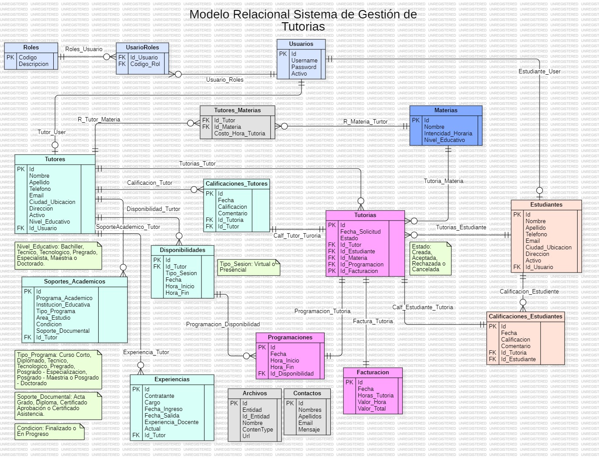

# TalentoTech Proyecto Final.

# Capa de Presistencia y Negocio del Sistema de Tutorias

## Modelo Relacional ERD.



## Requisitos Previos.

1. Instalar Node.js y npm
2. Instalar Sequelize para MySQL
3. Instalar MySQL en local o mediante Docker
4. Crear la base de datos con el nombre `tutoriaDb`
5. Configurar la Conexión a la Base de Datos en el archivo `.env` para que el archivo `config.json` asumas los valores de las variables de entorno.

```bash
"development": {
    "username": "${DB_USER}",
    "password": "${DB_PASS}",
    "database": "${DB_NAME}",
    "host": "${DB_HOST}",
    "dialect": "mysql"
  }
```

## Crear Base de Datos.

```bash
npx sequelize-cli db:create
```

## Ejercutar Migraciones.

```bash
npx sequelize-cli db:migrate
```

## Revertir la última migración

```bash
npx sequelize-cli db:migrate:undo
```

## Dependencias a Instalar.

1. Instalar `express` como framework web minimalista para Node.js.

```bash
npm install -g express@latest
```

2. Instalar `bcrypt` para el hashing de contraseñas.

```bash
npm install -g bcrypt@latest
```

3. Instlar `cors` para habilitar CORS (Cross-Origin Resource Sharing) en aplicaciones Express.

```bash
npm install cors
```

4. Instalar `jsonwebtoken`:

```bash
npm install -g jsonwebtoken@latest
```

5. Instalar `sequelize` como ORM (Object-Relational Mapping) para Node.js

```bash
npm install sequelize
```

6. Instalar `sequelize-cli` como herramienta para gestionar modelos, migraciones y semillas en sequelize.

```bash
npm install sequelize-cli
```

7. Instalar `dotenv` que te permite cargar variables de entorno desde un archivo .env a process.env en Node.js

```bash
npm install dotenv
```

7.1. Crear un archivo .env y incluir en este todos los datos confidenciales de la aplicación como contraseñas.

```bash
JWT_SECRET=your_jwt_secret_key
DB_HOST=localhost
DB_USER=root
DB_PASS=s1mpl3

// Clave secreta para JWT desde variables de entorno
const JWT_SECRET = process.env.JWT_SECRET;
```

8. Instalar `date-fns` para el manejo de fechas.

```bash
npm install date-fns
```

9. Instalar `multer` para el manejo de archivos.

```bash
npm install multer
```

`Nota:` No es necesario instalar una a una cada dependencia, solo debe ejecutar:

```bash
npm install
```

## Autores.

- [Alejandro Herrera Montilla @alhemoasde](https://www.linkedin.com/in/alhemoasde) Backend Developer
